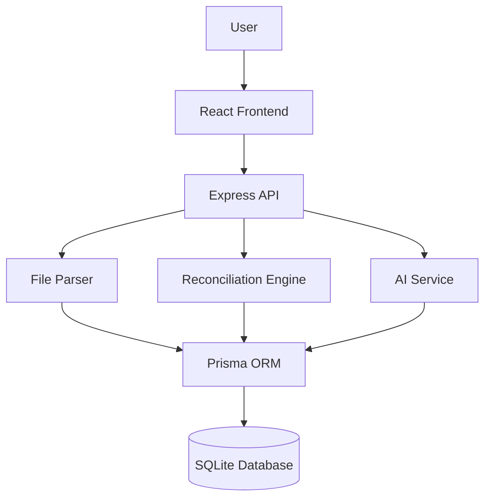

# RECONX AI

> **Turn payment chaos into financial clarity.**

AI-powered payment reconciliation, exception detection, and settlement intelligence.

RECONX AI is a full-stack fintech platform that automates reconciliation across bank statements, merchant ledgers, and payment settlement reports. It matches transactions, detects discrepancies, explains exceptions, and provides actionable financial insights.

---

## Problem

Financial teams often reconcile payment data manually across multiple sources. Differences in transaction IDs, amounts, dates, fees, and settlement timings make the process slow, difficult to scale, and prone to errors.

RECONX AI addresses this by bringing financial data into one workspace and automating transaction matching, exception detection, and reconciliation analysis.

---

## Solution

RECONX AI provides an end-to-end reconciliation workflow:

- Upload CSV / XLSX / XLS financial data
- Automatically map and normalize transaction fields
- Match transactions across multiple sources
- Assign confidence scores to reconciliation results
- Detect mismatches, duplicates, missing and partial settlements
- Use AI to explain unresolved exceptions
- Track financial exposure and settlement insights
- Resolve exceptions and generate reports

The platform combines **rule-based reconciliation for reliable matching** with **AI-assisted analysis for ambiguous cases**.

---

## How It Works

```text
Import
   ↓
Column Mapping
   ↓
Data Normalization
   ↓
Multi-Level Matching
   ↓
Confidence Scoring
   ↓
Exception Detection
   ↓
AI Analysis
   ↓
Resolution & Reports
```

---

### Matching Strategy

1. **Exact Reference Match** — Payment ID, Order ID, Transaction ID, Settlement ID
2. **Amount + Date Match** — Configurable tolerance
3. **Fuzzy Reference Match** — Handles minor reference differences
4. **Metadata Match** — Customer and payment information
5. **AI Analysis** — Assists with ambiguous exceptions

---

## Tech Stack

| Layer | Technology |
| --- | --- |
| Frontend | React, Vite, TypeScript, Tailwind CSS |
| UI & Animation | Framer Motion, Recharts, Three.js |
| Backend | Node.js, Express, TypeScript |
| Database | SQLite, Prisma |
| Authentication | JWT, bcrypt |
| File Processing | csv-parse, SheetJS |
| AI | OpenAI-compatible API + deterministic fallback |

---

## Architecture


---
## Run Locally

### Prerequisites
```bash
- Node.js
- npm
```

### Installation

```bash
git clone https://github.com/arifashaik-bot/reconx-ai.git
cd reconx-ai
```

### Environment Setup
```bash
Copy `.env.example` and rename the copy to `.env` in the `backend` folder before running the application.
```

### Database Setup
**Terminal 1 (Backend - Port 5000):**
```bash
cd backend
npx prisma generate
npx prisma db push
npm test
npm run dev
cd ..
```

**Terminal 1 (Frontend - Port 5173):**
```bash
cd frontend
npm install
npm run build
npm run dev
```

- Frontend: http://localhost:5173
- Backend: http://localhost:5000

---

## API

| Module | Endpoints |
| --- | --- |
| Auth | `/api/auth/*` |
| Imports | `/api/import/*` |
| Reconciliation | `/api/reconciliation/*` |
| Transactions | `/api/transactions/*` |
| Exceptions | `/api/exceptions/*` |
| Dashboard | `/api/dashboard/*` |
| AI | `/api/ai/*` |
| Settlements | `/api/settlements` |
| Reports | `/api/reports/*` |
| Settings | `/api/settings` |
| Audit | `/api/audit` |
| Demo | `/api/demo/launch` |

---

## Future Scope

- Direct payment provider API integrations
- Automated bank integrations
- ERP and accounting integrations
- Advanced AI investigation
- Predictive settlement and exception risk
- Automated low-risk exception resolution
- Multi-tenant SaaS architecture
- PostgreSQL-based high-volume processing
